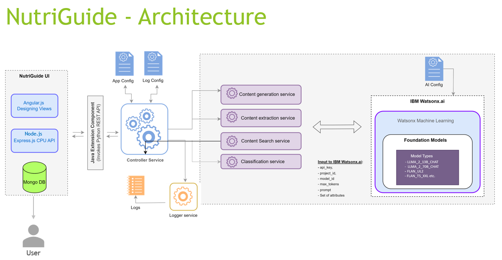

# nutriGuide

## Overview
NutriGuide, your go-to resource for understanding food and calorie intake!
We provide a unique AI powered platform to help you navigate the complexities of food choices and their impact on your overall health.

## Features
- In-Depth Food Queries
    An interactive support platform where you can inquire about specific food items to discover their calorie content, macronutrient breakdown, and potential health benefits or concerns tailored to your health profile.

- Personalized Guidance
    Resources to help you understand your unique nutritional needs and how to meet them effectively.

- Calorie Database
    An extensive collection of food items with detailed calorie information and nutritional profiles, making it easy to track your intake.

## Requirements
- Operating System: Windows, macOS, Linux
- Software: Node.js, AngularJS, Python, Watsonx

## Installation

### Step 1: Clone the Repository
```bash
git clone https://github.com/sonia-gaonkar/nutriguide.git
```

### Step 2: Install Dependencies
```bash
# For Node.js 
# cd nutriguide/nutiguide_ui
npm install

# For angularJS
# cd nutriguide/nutiguide_ui/app/frontend
npm install

# cd nutriguide/nutiguide_ui/app/frontend   to generate dist folder
ng build --configuration production

# For Python app
pip install -r requirements.txt

# If you are deploying services on Linux Virtual Machine, go to /certificate and run below command and input required details.
openssl req -newkey rsa:2048 -nodes -keyout ca.key -x509 -days 365 -out ca.crt
```

### Step 3: Configure Environment Variables
- Create a `.env` file in the root directory.
- Add your configuration settings: Go to /config folder and replace below content in ai-integration.ini.default file under [WATSON_CONF] section.
	- project_id=
	- api_key=
	- url=
- DATABASE_URL=mongodb://127.0.0.1:27017/?directConnection=true&serverSelectionTimeoutMS=2000&appName=mongosh+2.2.12


## Usage

### Step 1: Start the Application
```bash
# For Node.js apps
npm start server.js

# For Python apps
Python 3.x.x configure_env.py to configure logs
Python 3.x.x start_services.py

# Check the status of the integrated AI services by running following script.
Python 3.x.x status.py

```

### Step 2: Access the App
- Open your web browser and go to `http://localhost:8888` 

### Solution architecture


## Contributing
If you’d like to contribute, please follow these steps:
1. Fork the repository.
2. Create a new branch: `git checkout -b feature-branch`
3. Make your changes and commit them: `git commit -m 'Add new feature'`
4. Push to your branch: `git push origin feature-branch`
5. Create a Pull Request

## License
Copyright NutriGuide. All Rights Reserved.
